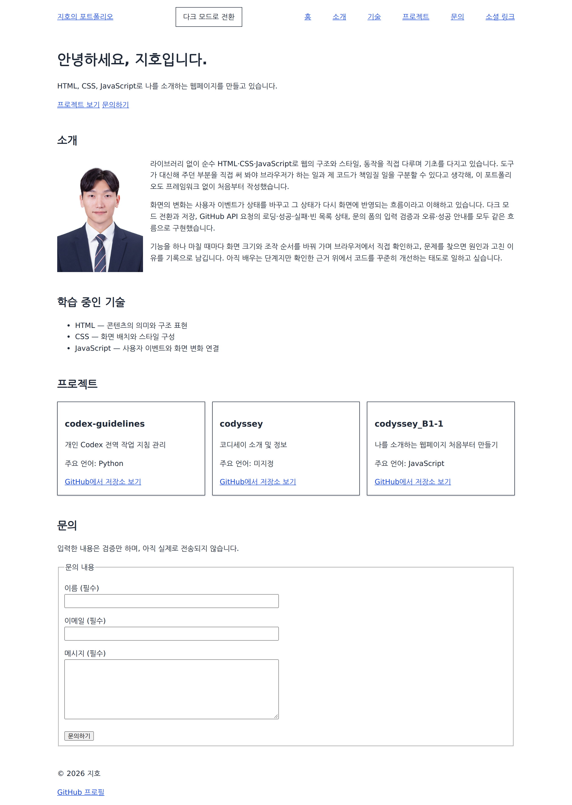
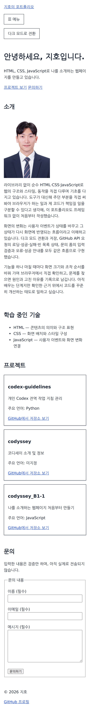
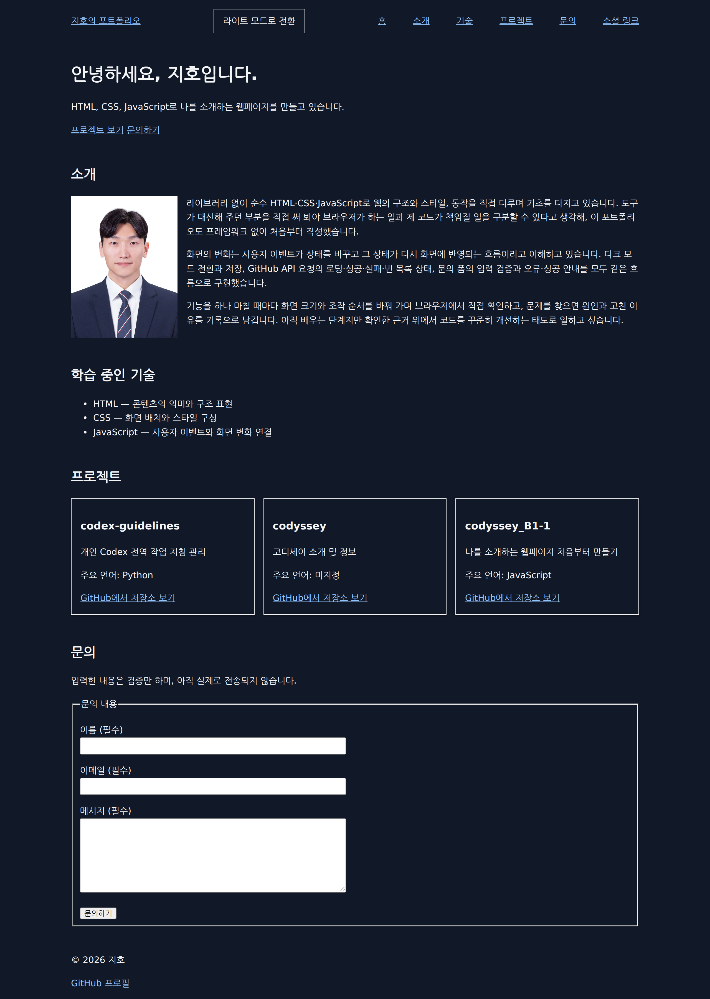

# codyssey_B1-1 — 자기소개 포트폴리오

순수 HTML·CSS·JavaScript로 만든 반응형 자기소개 포트폴리오입니다. 라이브러리와 프레임워크를 쓰지 않고, **사용자 이벤트 → 상태 변경 → 화면 업데이트**의 흐름을 직접 구현하며 DOM 조작·이벤트·비동기 처리를 익히는 것이 목적입니다.

- 배포 주소: <https://gimziho.github.io/codyssey_B1-1/>
- 저장소 주소: <https://github.com/GimZiHo/codyssey_B1-1>

관련 문서: [과제 요구사항 원문](docs/assignment-requirements.pdf) · [작업 지침](AGENTS.md) · [진행 상태와 체크리스트](docs/progress.md) · [학습 기록](docs/learning/README.md)

## 화면

| 데스크톱 1280px | 모바일 375px | 다크 모드 |
| --- | --- | --- |
|  |  |  |

세 장 모두 정식 Google Chrome 153.0.8010.52에서 캡처했습니다. 프로젝트 카드는 실제 GitHub API 응답을 그대로 사용했습니다.

## 사용 기술과 선택 이유

| 기술 | 쓴 곳 | 선택한 이유 |
| --- | --- | --- |
| HTML 시맨틱 태그 | 전체 구조 | `div` 대신 `header`·`nav`·`main`·`section`·`article`·`footer`로 영역의 뜻을 표시했습니다. 브라우저와 보조기기가 구조를 그대로 읽습니다 |
| CSS 사용자 지정 속성 | 색상·글꼴·간격 | 다크 모드 전환이 변수 값 교체 한 번으로 끝납니다. 색을 쓰는 규칙마다 고칠 필요가 없습니다 |
| Flexbox | 내비게이션 | 로고와 메뉴를 한 줄의 양 끝에 두는 **한 축** 배치라 Flexbox가 맞습니다 |
| CSS Grid (`auto-fit`, `minmax`) | 프로젝트 카드 | 카드 수가 API 응답에 따라 달라지므로, 열 수를 고정하지 않고 화면 폭에 맞춰 브라우저가 정하게 했습니다 |
| 미디어 쿼리 (768px·1024px) | 반응형 | 모바일을 기본값으로 두고 넓은 화면에서 규칙을 더하는 모바일 퍼스트 방식입니다 |
| `localStorage` | 테마 저장 | 새로고침해도 선택한 테마가 남아야 하므로 브라우저에 저장합니다 |
| Intersection Observer | 섹션 등장 효과 | `scroll` 이벤트로 매 프레임 위치를 계산하는 대신, 교차 판정을 브라우저에 맡깁니다 |
| `fetch` + `async/await` | GitHub API | 요청 전후의 순서를 위에서 아래로 읽히게 쓰고, 실패는 `try/catch` 한 곳에서 처리합니다 |
| Live Server | 개발 | `file://`로 열면 상대 경로·요청 동작이 실제 배포와 달라져 HTTP로 띄웁니다 |
| Playwright + 정식 Chrome | 검증 | 스크롤 경계값처럼 **시간과 상태에 따라 변하는 동작**은 정지 화면으로 확인할 수 없어 브라우저를 실제로 조작해 확인합니다 |

외부 라이브러리·프레임워크(React, Vue, jQuery, Bootstrap 등)는 과제 조건에 따라 쓰지 않았고, `var`·인라인 `onclick`·인라인 `style`도 쓰지 않았습니다.

## 주요 디렉터리

- `index.html`: GitHub Pages의 사이트 루트로 들어왔을 때 `src/index.html`로 넘기는 진입점입니다.
- `src/index.html`: Hero, About, Skills, Projects, Contact와 상단 메뉴·하단 정보를 정의합니다.
- `src/css/style.css`: `:root`의 색상·글꼴·간격 변수, `[data-theme="dark"]`의 다크 모드 값, Flexbox·Grid 배치와 미디어 쿼리를 담습니다.
- `src/js/main.js`: 메뉴 토글, 스크롤에 따른 버튼·배경 전환, 테마 저장·복원, 섹션 등장 관찰, 문의 폼 검증, GitHub API 요청과 상태별 렌더링을 연결합니다.
- `src/images/`: 프로필 사진(`profile.jpg`, 936×1247)을 둡니다.
- `src/tests/`: 브라우저 자동 검증 스크립트와 실행 결과입니다. 버전 관리에는 넣지 않습니다.
- `docs/`: 과제 PDF, 진행 상태, 도구 환경 문서를 둡니다.
- `docs/learning/`: 개념별로 무엇을 왜 그렇게 구현했고 어떻게 확인했는지 기록합니다.
- `docs/images/screenshots/`: 기능별 확인 화면과 제출용 화면(`submission/`)입니다.

## 실행 방법

VS Code와 Live Server 확장(Ritwick Dey)을 사용합니다.

1. VS Code에서 저장소 폴더를 엽니다.
2. `src/index.html`을 우클릭하고 **Open with Live Server**를 선택합니다.
3. 브라우저에서 `http://127.0.0.1:5500/src/index.html`이 열립니다. 파일을 저장하면 화면이 자동으로 새로고침됩니다.

Live Server 없이 확인하려면 저장소 루트에서 아래를 실행하고 `http://localhost:8000/src/index.html`에 접속합니다. 종료는 `Ctrl+C`입니다.

```bash
python3 -m http.server 8000
```

## 확인 방법

직접 확인할 때는 다음 순서로 봅니다.

1. **반응형**: 개발자 도구에서 폭을 375px → 768px → 1280px로 바꿉니다. 375px에서는 메뉴가 햄버거 버튼 안으로 들어가고 카드가 1열, 넓은 화면에서는 메뉴가 가로로 펼쳐지고 카드가 여러 열이 됩니다.
2. **메뉴와 이동**: 모바일 폭에서 메뉴 버튼을 눌러 열고 닫습니다. 링크를 누르면 해당 영역으로 부드럽게 이동합니다.
3. **스크롤**: 60px을 넘으면 내비게이션 배경이 바뀌고, 300px을 넘으면 오른쪽 아래에 맨 위로 버튼이 나타납니다.
4. **테마**: 테마 버튼을 누르고 새로고침합니다. 선택한 테마가 그대로 남습니다.
5. **등장 효과**: 천천히 내리면 섹션 제목이 20% 보일 때 각 영역이 떠오르며 나타납니다.
6. **API**: 프로젝트 영역이 로딩 문구 → 저장소 카드 순으로 바뀝니다. 실패하면 오류 안내와 재시도 버튼이 나옵니다.
7. **폼 검증**: 빈 값으로 제출하면 필드마다 오류가 표시되고, 이메일 형식이 맞지 않아도 오류가 나옵니다. 모두 채워 제출하면 성공 안내가 뜨고, 값을 고치면 안내가 사라집니다.

자동 검증은 아래로 실행합니다. `-s`로 시나리오를, `-v`로 화면 크기를 골라 실행할 수 있고, `--list`로 목록을 봅니다. 실행에 필요한 도구 경로는 [도구 환경](docs/tool-environment.md)에 정리했습니다.

```bash
CHROME_BIN="$HOME/.local/share/codex-tools/browser/runtime/opt/google/chrome/chrome" \
  node src/tests/final-browser-check.cjs
```

**최근 결과**: 정식 Google Chrome 153.0.8010.52에서 시나리오 11개(자산 로드, 반응형, 메뉴, 앵커 이동, 내비 배경, 맨 위로, 테마, 등장 효과, 소개 영역, GitHub API, 문의 폼)를 375·768·1280px에서 실행해 **462건 모두 통과**했습니다. 실제 `api.github.com` 호출도 HTTP 200으로 저장소 3건을 받아 카드로 그려지는 것을 확인했습니다. 과정과 판단 근거는 [기능 통합 검증](docs/learning/019-integration-verification.md)에 있습니다.

배포한 사이트에서도 같은 브라우저로 375·768·1280px의 진입점 이동, 자산 로드, 반응형, 메뉴, 스크롤 경계(60px·300px), 실제 GitHub API 호출, 등장 효과, 폼 검증, 테마 저장·복원을 확인해 **64건 모두 통과**했습니다.

```bash
node src/tests/deployed-site-check.cjs
```

## 구현 범위와 동작 기준

### 스크롤과 관찰 기준값

| 기능 | 기준과 동작 |
| --- | --- |
| 내비게이션 배경 | 스크롤 **60px** 이상이면 `scrolled` 클래스로 배경 변경, 미만이면 복원 |
| 맨 위로 버튼 | 스크롤 **300px** 이상이면 표시, 미만이면 숨김. 클릭하면 `window.scrollTo({ top: 0, behavior: 'smooth' })` |
| 섹션 등장 효과 | Intersection Observer `threshold` **0.2**. 섹션 **제목**이 20% 이상 보이면 `visible`을 붙이고 관찰을 해제해 한 번만 등장 |

등장 효과는 섹션이 아니라 제목을 관찰합니다. 섹션을 관찰하면 API 카드가 늘어 섹션이 화면보다 훨씬 커질 때 교차 비율이 0.2에 닿지 못해 영영 나타나지 않는 문제가 있었고, 통합 검증에서 이 결함을 찾아 고쳤습니다.

### 상태 변경과 렌더링

세 가지 상태를 각각 **바꾸는 지점**과 **그리는 지점**을 나눠 구현했습니다.

- **테마**: 버튼 클릭 → `html`의 `data-theme`과 `localStorage`의 `theme` 키 → CSS 변수 교체로 배경·글자·카드 그림자·안내 문구 색이 함께 바뀝니다.
- **API 요청**: `projectState` 하나가 `idle`·`loading`·`success`·`error`를 담고, `renderProjects()`만 화면을 그립니다. 요청 중에는 재시도를 눌러도 요청이 겹치지 않습니다. 403·429는 요청 한도 안내를, 404와 연결 실패는 각각의 안내를 표시합니다.
- **폼 검증**: 필드마다 입력·오류 표시 요소·검증 규칙을 함께 두고, `submit`에서 기본 동작을 막고 검사합니다. 오류가 표시된 필드만 `input`에 맞춰 다시 검사하며, 값을 고치면 직전 제출의 성공 안내를 지웁니다.

API 응답의 문자열은 `innerHTML`에 넣기 전에 HTML에서 뜻을 가지는 문자를 바꾸고, 링크는 `https://github.com/`로 시작하는 주소만 만듭니다.

## 개발 기간과 역할

- **기간**: 2026-09-06 ~ 2026-09-19 (커밋 38개)
- **형태**: 개인 학습 과제
- **역할**: 요구사항 정리, 작업 범위 지시, 결과 검토와 수용 판단을 직접 했습니다. 구현과 검증, 학습 기록 작성에는 AI 코딩 도구(Codex CLI, Claude Code)를 사용했고, 개념별로 무엇을 왜 그렇게 정했는지 [학습 기록](docs/learning/README.md)에 남겼습니다.

## 결과와 한계

구현한 것은 위 "구현 범위"와 같고, 다음은 **하지 않았거나 확인하지 못한 것**입니다.

- **문의 폼은 검증까지만 합니다.** 입력값을 실제로 어디로도 전송하지 않으며, 화면에도 전송했다고 안내하지 않습니다.
- **GitHub API는 로그인 없이 호출**하므로 시간당 60회 제한이 있습니다. 한도를 넘으면 오류 안내와 재시도 버튼이 나옵니다.
- **자동 검증은 브라우저를 스크립트로 조작한 결과**입니다. 사람이 직접 눈으로 보며 조작한 확인은 하지 않았습니다.
- **다크 모드에서 입력 컨트롤은 브라우저 기본 스타일**을 따릅니다. 과제가 요구한 범위 밖이라 별도로 맞추지 않았습니다.
- **선택 과제는 구현하지 않았습니다**: 언어별 필터링, Hero 타이핑 효과, 실제 폼 전송, 시스템 테마 감지.
- 접근성은 과제가 요구한 이미지 `alt`와 폼 `label` 연결까지만 했고, 그 밖의 보완으로 범위를 넓히지 않았습니다.

## 학습 기록

개념별 기록은 [학습 목록](docs/learning/README.md)에 있습니다.

| 문서 | 다루는 내용 |
| --- | --- |
| [001 시맨틱 HTML](docs/learning/001-semantic-html.md) | 영역마다 태그를 고른 기준 |
| [002 앵커 링크](docs/learning/002-anchor-links.md) | `href`와 `id` 연결, 클릭·키보드 이동 |
| [003 외부 CSS·JS 연결](docs/learning/003-external-css-javascript.md) | 파일 분리와 `defer` 실행 시점 |
| [004 CSS 변수](docs/learning/004-css-custom-properties.md) | `:root`에 값을 모으고 `var()`로 참조 |
| [005 속성 선택자와 다크 모드](docs/learning/005-theme-attribute-selector.md) | `data-theme` 값으로 색상 규칙 전환 |
| [006 Flexbox 내비게이션](docs/learning/006-flexbox-navigation.md) | 한 축 배치와 양 끝 정렬 |
| [007 Grid 프로젝트 카드](docs/learning/007-grid-projects.md) | `auto-fit`·`minmax()`로 열 수 자동 결정 |
| [008 미디어 쿼리](docs/learning/008-media-queries.md) | 모바일 퍼스트와 768·1024px 경계 |
| [009 클릭 이벤트와 메뉴](docs/learning/009-menu-click-event.md) | `addEventListener`와 `classList.toggle` |
| [010 부드러운 스크롤](docs/learning/010-smooth-scrolling.md) | `scroll-behavior`로 이동 방식 지정 |
| [011 스크롤 이벤트](docs/learning/011-scroll-event.md) | `scrollY`를 읽어 버튼 표시 갱신 |
| [012 조건부 클래스](docs/learning/012-conditional-class-toggle.md) | `classList.toggle`의 조건 인자 |
| [013 localStorage 테마](docs/learning/013-local-storage-theme.md) | 선택 저장과 초기 복원 |
| [014 Intersection Observer](docs/learning/014-intersection-observer.md) | 교차 비율 판정과 관찰 해제, 긴 목록에서 생긴 결함 |
| [015 hover·transition·shadow](docs/learning/015-hover-transition-shadow.md) | 상태 선택자와 전환 선언 위치 |
| [016 폼 검증](docs/learning/016-form-validation.md) | `submit`·`input` 이벤트와 오류 표시 |
| [017 성공 안내 상태](docs/learning/017-form-success-state.md) | 성공 안내를 켜고 끄는 단일 지점 |
| [018 fetch와 요청 상태](docs/learning/018-async-fetch-states.md) | 로딩·성공·빈 목록·실패 렌더링 |
| [019 기능 통합 검증](docs/learning/019-integration-verification.md) | 기능이 맞닿는 경계와 실패 원인 구분 |
| [020 Live Server](docs/learning/020-live-server.md) | 로컬 HTTP 서버와 자동 새로고침 |
| [021 이미지 배치](docs/learning/021-image-alt-aspect-ratio.md) | 대체 텍스트와 원본 비율 유지 |
