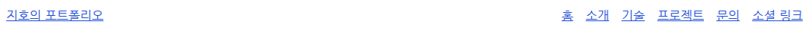
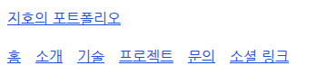

# Flexbox로 내비게이션 배치하기

## 1. 학습 목적

[과제 PDF](../assignment-requirements.pdf) 3쪽은 내비게이션에 Flexbox를 사용해 로고를 왼쪽, 메뉴를 오른쪽에 배치하도록 요구한다. 현재 로고 역할을 하는 이름 링크와 메뉴 목록을 배치하며 부모와 직접 자식의 관계를 학습한다.

## 2. 핵심 개념

Flexbox는 한 방향을 기준으로 요소를 정렬하고 공간을 배분하는 CSS 배치 방식이다. `display: flex`를 지정한 부모를 flex container(배치 기준이 되는 상자), 그 안의 직접 자식을 flex item(배치되는 항목)이라고 한다.

현재 가로쓰기와 기본 `flex-direction: row`에서는 주축(항목을 나열하는 방향)이 가로, 교차축(주축에 수직인 방향)이 세로다.

| 속성 | 이번 코드에서의 역할 |
| --- | --- |
| `display: flex` | 직접 자식을 Flexbox 항목으로 배치한다. |
| `justify-content: space-between` | 같은 줄의 주축 여유 공간을 항목 사이에 배분한다. |
| `align-items: center` | 같은 줄의 항목을 교차축 중앙에 맞춘다. |
| `flex-wrap: wrap` | 한 줄에 공간이 부족하면 다음 줄로 넘긴다. |
| `gap: var(--space-page)` | 항목과 줄 사이에 최소 1rem 간격을 둔다. |

`justify-content`가 언제나 가로 정렬을 뜻하는 것은 아니다. 여기서는 기본 row 방향이므로 가로로 작동한다.

## 3. 프로젝트 적용

아래 코드와 캡처는 Flexbox 도입 단계의 배치다. 이후 [미디어 쿼리 단계](008-media-queries.md)에서 모바일 기본 방향을 column으로, 768px 이상을 row로 변경했다.

[src/index.html](../../src/index.html)의 구조를 줄이면 다음과 같다.

```html
<nav>
  <a href="#hero">지호의 포트폴리오</a>
  <ul>
    <li><a href="#hero">홈</a></li>
    <!-- 나머지 메뉴 -->
  </ul>
</nav>
```

`nav`의 직접 자식은 이름 링크와 `ul` 두 개다. `nav`에 Flexbox를 적용하는 것만으로 `ul` 안의 메뉴까지 가로 배치되지는 않는다. 그래서 `ul`에도 따로 Flexbox를 적용한다.

[src/css/style.css](../../src/css/style.css)의 핵심 규칙:

```css
nav {
  display: flex;
  justify-content: space-between;
  align-items: center;
  flex-wrap: wrap;
  gap: var(--space-page);
}
```

`nav ul`에도 `display: flex`, `flex-wrap: wrap`, `gap`을 지정했다. 목록의 기본 점과 여백은 `list-style: none`, `margin: 0`, `padding: 0`으로 제거해 메뉴 배치 간격을 직접 정한다. `nav ul`은 nav 안의 ul을 선택하므로 Skills 목록은 영향을 받지 않는다.

## 4. 실행 흐름

1. 입력은 nav의 HTML 구조와 사용할 수 있는 화면 폭이다.
2. 브라우저가 이름 링크와 메뉴 목록을 Flexbox 항목으로 배치한다.
3. 넓은 화면에서는 남는 공간이 두 항목 사이에 배분되어 이름은 왼쪽, 메뉴는 오른쪽에 놓인다.
4. 좁은 화면에서 같은 줄에 들어가지 않으면 메뉴 목록이 다음 줄로 내려간다. 목록 자체의 공간도 부족하면 개별 메뉴가 줄바꿈한다.

## 5. 확인 방법과 결과

실습: [실행 방법](../../README.md#실행과-확인)에 따라 페이지를 열고 창 폭을 줄여 본다. 넓은 화면에서 이름과 메뉴가 양쪽에 놓이고, 좁은 화면에서는 메뉴가 아래로 내려가는지 확인한다. Elements에서 nav의 `display: flex`를 잠시 해제하면 두 묶음의 양쪽 정렬이 사라진다. ul의 Flexbox는 별도 규칙이므로 메뉴들끼리의 가로 배치는 유지된다.

2026-09-08 로컬 HTTP 서버, Chromium 153.0.8010.12, Playwright 1.63.0, 한글 나눔 글꼴을 사용할 수 있는 환경에서 검증하고 내비게이션 부분을 캡처했다.



1280×720 화면: nav 폭은 1024px이며 이름의 왼쪽 끝과 메뉴의 오른쪽 끝이 각각 nav 경계에 맞았다. 두 항목의 세로 중심도 일치했다.



375×720 화면: nav 폭은 343px이며 메뉴 목록이 이름 아래 줄로 이동했다. 가로 넘침이 없고 여섯 메뉴가 모두 존재하며 프로젝트 링크 클릭 후 `#projects`로 이동했다.

현재는 Flexbox의 자연스러운 줄바꿈까지 구현했다. 768px·1024px 브레이크포인트는 [미디어 쿼리 단계](008-media-queries.md)에서 추가했다. 모바일 햄버거 메뉴는 [클릭 이벤트 단계](009-menu-click-event.md)에서 추가했다.

## 6. 질문과 추가 확인

추가 확인: nav와 ul 중 어느 요소의 `display: flex`를 해제했는지에 따라 배치가 달라진다. 각 부모의 직접 자식이 무엇인지 HTML에서 찾아 비교한다.

## 7. 참고자료

- [과제 PDF 3쪽](../assignment-requirements.pdf): Flexbox 내비게이션 요구사항.
- [W3C CSS Flexbox Level 1 — Flex Containers](https://www.w3.org/TR/css-flexbox-1/#flex-containers): 부모와 직접 자식의 배치 관계.
- [같은 명세 — flex-wrap](https://www.w3.org/TR/css-flexbox-1/#flex-wrap-property): 공간 부족 시 줄바꿈.
- [같은 명세 — Alignment](https://www.w3.org/TR/css-flexbox-1/#alignment): 주축·교차축 정렬.

2025-10-14 Candidate Recommendation Draft를 2026-09-08에 확인했다.
