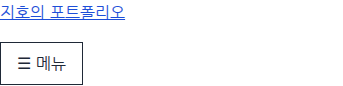
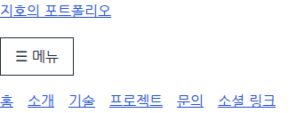

# 클릭 이벤트로 모바일 메뉴 열고 닫기

## 1. 학습 목적

[과제 PDF](../assignment-requirements.pdf) 4쪽의 햄버거 메뉴 토글을 구현한다. 이벤트(사용자 조작 같은 발생 사실)에 함수를 연결하고, 클래스 변경을 통해 화면이 달라지는 흐름을 익힌다.

## 2. 핵심 개념

DOM은 브라우저가 HTML을 해석해 만든 요소들의 구조다. JavaScript로 요소를 선택하고 이벤트에 반응해 속성을 바꿀 수 있다.

| 표현 | 입력과 동작 | 반환값 |
| --- | --- | --- |
| `document.querySelector('#menu-toggle')` | CSS 선택자에 맞는 첫 요소를 찾는다. | 요소 또는 없으면 null |
| `addEventListener('click', 함수)` | 클릭이 발생할 때 실행할 함수를 등록한다. | undefined |
| `classList.toggle('active')` | 클래스가 없으면 추가하고 있으면 제거한다. | 추가 후 true, 제거 후 false |
| `setAttribute('aria-expanded', 값)` | 지정한 속성을 해당 값으로 설정한다. | undefined |
| `String(isOpen)` | 불리언(참·거짓) 값을 문자열로 바꾼다. | `'true'` 또는 `'false'` |

`const`는 변수에 다른 값을 다시 대입하지 못하게 하는 선언이다. 요소를 담은 const 변수라도 그 요소의 클래스는 바꿀 수 있다. `() => { ... }`는 화살표 함수 문법이며, 여기서는 클릭할 때 실행할 코드를 묶는다. 등록할 때 바로 함수 본문을 실행하는 것이 아니다.

## 3. 프로젝트 적용

[src/js/main.js](../../src/js/main.js)의 핵심 코드:

```js
const menuButton = document.querySelector('#menu-toggle');
const navigationMenu = document.querySelector('#navigation-menu');

menuButton.addEventListener('click', () => {
  const isOpen = navigationMenu.classList.toggle('active');
  menuButton.setAttribute('aria-expanded', String(isOpen));
});
```

[src/index.html](../../src/index.html)에 실제 button 요소를 추가했다. `aria-controls="navigation-menu"`는 제어할 목록의 ID, `aria-expanded`는 열림 여부를 보조 기술에 전달한다. ☰ 기호는 장식이므로 aria-hidden으로 제외하고 '메뉴'라는 텍스트로 버튼을 식별한다.

[src/css/style.css](../../src/css/style.css)에서는 `nav.menu-ready ul`을 숨기고, `nav.menu-ready ul.active`를 표시한다. 768px 이상에서는 메뉴를 항상 표시하고 버튼을 숨긴다.

초기 HTML은 버튼에 hidden을 지정하고 메뉴는 보여 준다. 이벤트를 연결한 뒤 `classList.add('menu-ready')`로 초기화 완료를 표시하고 `menuButton.hidden = false`로 버튼을 드러낸다. `add`는 클래스를 추가하며 반환값은 undefined다. 이 순서 덕분에 JavaScript가 실행되지 않으면 작동하지 않는 버튼 대신 기존 링크가 남는다.

`defer`로 연결한 파일이므로 위 요소들이 만들어진 뒤 선택한다. 페이지 안의 이동은 기존 앵커 링크가 담당한다.

## 4. 실행 흐름

1. 초기화: 버튼에 click 함수를 등록하고 모바일 메뉴를 접는다.
2. 입력: 사용자가 메뉴 버튼을 클릭한다.
3. `toggle('active')`가 클래스를 추가하고 true를 반환한다.
4. `aria-expanded`를 `'true'`로 맞춘다. CSS가 active 조건에 따라 메뉴를 표시한다.
5. 다시 클릭하면 클래스를 제거하고 false를 반환한다. 속성은 `'false'`가 되고 메뉴가 숨겨진다.

이번에는 active 클래스가 모바일 열림 상태를 나타낸다. 별도의 중복 상태 변수 대신 toggle의 결과로 속성을 맞춘다. 768px 이상에서는 CSS 규칙으로 목록이 항상 보인다.

## 5. 확인 방법과 결과

실습: [실행 방법](../../README.md#실행과-확인)에 따라 페이지를 열고 화면 폭을 375px로 맞춘다. 버튼을 두 번 눌러 열림·닫힘을 확인한다. Elements에서 `ul`의 active 클래스와 버튼의 aria-expanded가 함께 바뀌는지 관찰한다. Tab으로 버튼에 이동한 뒤 Enter 또는 Space로도 조작해 본다.



초기 상태: 목록에 active가 없고 버튼의 aria-expanded는 false다.



클릭 후: active가 추가되고 aria-expanded가 true가 되면서 링크가 나타난다.

2026-09-08 로컬 HTTP 서버, Chromium 153.0.8010.12, Playwright 1.63.0, 한글 나눔 글꼴 환경에서 검증했다.

- 375×720에서 반복 클릭, Enter·Space 조작, aria-expanded 동기화와 프로젝트 링크 이동 통과.
- 320·767px에서 버튼 표시·초기 메뉴 숨김, 768·1024px에서 버튼 숨김·메뉴 표시 통과. 가로 넘침 없음.
- 닫힌 상태에서 넓은 화면으로 전환 후 375px로 복귀하면 다시 닫힌 상태로 표시.
- JavaScript 비활성화 시 버튼은 숨겨지고 메뉴 링크는 표시.
- 페이지 JavaScript 오류 없음, 소스 문법 검사 통과.

메뉴 링크를 눌렀을 때 자동으로 닫는 동작은 현재 추가하지 않았다. 열린 상태로 넓은 화면을 거쳐 모바일로 돌아오면 열림 상태를 유지한다.

## 6. 질문과 추가 확인

질문: `ul.active`의 `display: flex`를 빼면 메뉴가 사라지는 이유는 무엇인가?

모바일에서는 다음 두 규칙이 메뉴의 표시 여부를 결정한다.

```css
nav.menu-ready ul {
  display: none;
}

nav.menu-ready ul.active {
  display: flex;
}
```

active가 추가돼도 첫 번째 선택자에 계속 해당한다. 두 번째 규칙의 display 선언을 없애면 숨김을 덮어쓸 값이 없어 첫 번째 규칙의 `display: none`이 적용된다. none은 요소와 자식들의 화면 배치 상자를 만들지 않으므로 메뉴와 그 공간이 보이지 않게 된다. DOM에서 요소를 삭제하는 것은 아니다.

active는 개발자가 정한 클래스 이름이며 자체적인 표시 기능이 없다. 초기 `nav ul { display: flex; }`보다 `nav.menu-ready ul`이 클래스 조건을 더 포함해 명시도(같은 속성에 적용할 규칙을 정할 때 비교하는 선택자의 우선순위)가 높다. 열림 규칙은 여기에 active 조건을 더해 숨김 규칙보다 명시도가 높다.

직접 확인할 때는 375px에서 메뉴를 연 다음 Elements에서 `nav.menu-ready ul.active`의 `display: flex` 체크를 해제한다. 예상 결과는 active 클래스와 aria-expanded는 그대로인데 화면에서는 메뉴가 숨겨지는 것이다. 다시 체크하면 표시된다. `display: block`으로 바꾸어도 메뉴는 표시되지만 목록 항목의 Flexbox 가로 배치가 풀린다. 768px 이상에는 별도의 메뉴 표시 규칙이 있으므로 모바일 폭에서 비교한다.

추가 확인: JavaScript는 display 값을 직접 바꾸지 않는다. 클래스만 바꾸며 실제 표시 방식은 CSS가 결정한다.

## 7. 참고자료

- [과제 PDF 4쪽](../assignment-requirements.pdf): addEventListener와 classList.toggle 메뉴 요구사항.
- [WHATWG DOM — addEventListener](https://dom.spec.whatwg.org/#dom-eventtarget-addeventlistener): 이벤트와 함수 연결.
- [WHATWG DOM — toggle](https://dom.spec.whatwg.org/#dom-domtokenlist-toggle): 클래스 토글과 반환값.
- [W3C Selectors Level 4 — Specificity](https://www.w3.org/TR/selectors-4/#specificity-rules): 겹치는 선택자의 명시도 비교.
- [W3C CSS Display Level 3 — none](https://www.w3.org/TR/css-display-3/#valdef-display-none): 요소와 자식의 배치 상자를 생성하지 않는 동작.

DOM Living Standard를 2026-09-08에 확인했다.
