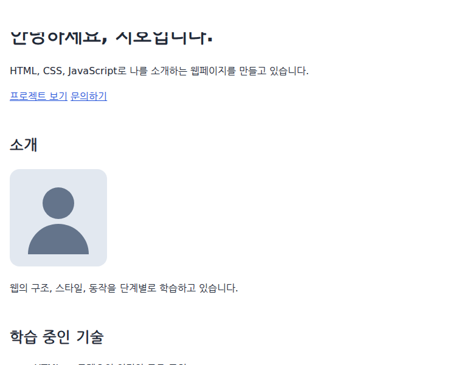
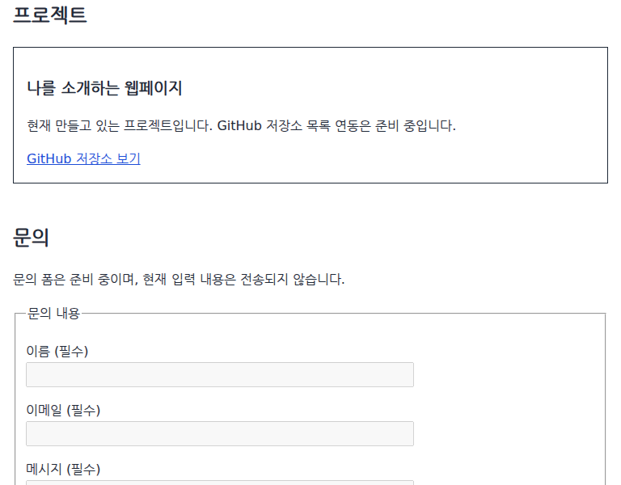

# CSS로 앵커 이동을 부드럽게 만들기

## 1. 학습 목적

[과제 PDF](../assignment-requirements.pdf) 4쪽의 부드러운 섹션 이동을 구현한다. [앵커 링크](002-anchor-links.md)가 정한 목적지까지 이동하는 방식을 CSS로 지정한다.

## 2. 핵심 개념

`scroll-behavior`는 앵커 이동처럼 브라우저가 수행하는 스크롤의 방식을 지정하는 CSS 속성이다. `smooth`는 중간 위치를 거쳐 부드럽게 이동하고, `auto`는 즉시 이동한다. 마우스 휠이나 손가락으로 직접 스크롤하는 속도를 정하는 속성은 아니다.

`:root`에 지정하면 페이지를 표시하는 영역인 뷰포트의 스크롤에 적용된다. HTML에서는 최상위 `html` 요소가 이에 해당한다. 이 속성은 자식 요소에 상속되지 않으며, body에만 지정한 값은 뷰포트로 전달되지 않는다.

`prefers-reduced-motion: reduce`는 사용자가 불필요한 움직임을 줄이도록 설정했는지 확인하는 미디어 쿼리다. 앞서 화면 폭으로 CSS 적용 여부를 결정했다면, 여기서는 사용자의 동작 줄이기 설정이 조건이다.

## 3. 프로젝트 적용

[src/css/style.css](../../src/css/style.css)의 기존 `:root`에 다음 속성을 추가했다. 발췌에서는 색상·간격 변수 선언을 생략했다.

```css
:root {
  scroll-behavior: smooth;
}

@media (prefers-reduced-motion: reduce) {
  :root {
    scroll-behavior: auto;
  }
}
```

조건에 맞으면 뒤에 작성한 동일 선택자의 auto 선언이 적용된다. 움직임을 줄이면서도 목적지 이동은 유지한다.

[src/index.html](../../src/index.html)의 `href="#projects"`와 `id="projects"` 연결을 사용한다. 스크롤을 위한 JavaScript 함수나 라이브러리는 추가하지 않았다. 브라우저의 앵커 기능을 사용하므로 주소의 프래그먼트, 링크의 키보드 조작과 방문 기록도 유지된다.

## 4. 실행 흐름

1. 입력: 내비게이션의 '프로젝트' 링크를 클릭한다. 모바일에서는 먼저 메뉴 버튼을 눌러 링크를 연다.
2. 브라우저가 `href="#projects"`에서 이동할 요소를 찾고 주소 끝을 갱신한다.
3. 일반 설정에서는 smooth를 적용해 스크롤 위치가 중간 지점들을 거쳐 변한다.
4. 결과: 프로젝트 영역이 화면에 나타난다. 동작 줄이기 설정에서는 auto를 적용해 바로 이동한다.

이동 시간과 속도 곡선은 브라우저가 결정한다. 코드에서 시간을 지정하지 않았다. `#projects`가 주소에 표시되는 시점과 스크롤이 끝나는 시점은 다를 수 있다.

## 5. 확인 방법과 결과

실습 절차와 예상 동작:

1. [README의 실행 방법](../../README.md#실행과-확인)에 따라 페이지를 열고 맨 위로 이동한다.
2. 내비게이션 또는 Hero의 '프로젝트' 링크를 누른다. 소개와 기술 영역을 지나 프로젝트로 이동하는지 확인한다.
3. 개발자 도구의 명령 메뉴에서 **Show Rendering**을 실행한다. Rendering 패널의 **Emulate CSS media feature prefers-reduced-motion**을 **reduce**로 지정한다.
4. 페이지를 다시 열고 같은 링크를 누른다. 이번에는 이동 애니메이션 없이 목적지에 도착한다. 실습 후 에뮬레이션을 해제한다.

2026-09-09 로컬 HTTP 서버, Chromium 153.0.8010.12, Playwright 1.63.0, 한글 나눔 글꼴을 사용할 수 있는 환경에서 검증했다. 아래는 768×600 화면에서 실제 링크를 클릭한 실행 장면이다.



이동 중: 출발 위치와 목적지 사이의 소개·기술 영역이 보인다. 캡처 시점에 따라 보이는 중간 위치는 달라진다.



도착 후: 프로젝트 제목이 위쪽에 놓였다. 정지 이미지 두 장은 위치 변화를 보여 주며, 실제 중간 이동 여부는 프레임별 위치도 함께 관찰했다.

일반 설정에서 클릭 후 관찰한 값 중 일부:

| 클릭 후 경과 시간 | 문서 위쪽으로부터 스크롤 위치 |
| --- | --- |
| 0ms | 0px |
| 88ms | 111px |
| 155ms | 489px |
| 305ms | 732px |
| 455ms | 776px |

위 수치는 해당 실행의 관찰값이며 성능 목표나 고정된 애니메이션 시간은 아니다.

- 768×600 일반 설정: 계산된 scroll-behavior는 smooth이며 여러 중간 위치를 거쳐 약 776px에 도착했다.
- 375×720 모바일: 메뉴를 연 뒤 링크를 누르면 여러 중간 위치를 거쳐 약 954px에 도착했다.
- 768×600 reduce 설정: 계산된 값은 auto이며 첫 관찰 프레임에서 목적지 776px에 도착했다.
- JavaScript 비활성화 조건에서도 부드러운 앵커 이동과 도착을 확인했다.
- 1280×720에서 소개 링크의 Enter 키 이동과 브라우저 뒤로 가기를 확인했다. 검증한 페이지의 JavaScript 오류는 없었다.

## 6. 질문과 추가 확인

추가 확인: 주소의 `#projects`는 목적지를, scroll-behavior는 이동 방식을 정한다. 부드러운 이동이 보이지 않으면 동작 줄이기 설정과 최상위 요소에 적용된 CSS 값을 확인한다. 목적지가 문서 하단에 가까우면 남은 스크롤 공간 때문에 화면 맨 위까지 올라오지 않을 수 있다.

## 7. 참고자료

- [과제 PDF 4쪽](../assignment-requirements.pdf): 부드러운 스크롤 요구사항.
- [W3C CSS Overflow Level 3 — Smooth Scrolling](https://www.w3.org/TR/css-overflow-3/#smooth-scrolling): scroll-behavior의 값, 최상위 요소 적용과 브라우저가 정하는 이동 시간. 2025-10-07 Working Draft.
- [W3C Media Queries Level 5 — prefers-reduced-motion](https://www.w3.org/TR/mediaqueries-5/#prefers-reduced-motion): 동작 줄이기 선호 설정을 감지하는 조건.

참고자료 확인일: 2026-09-09.
