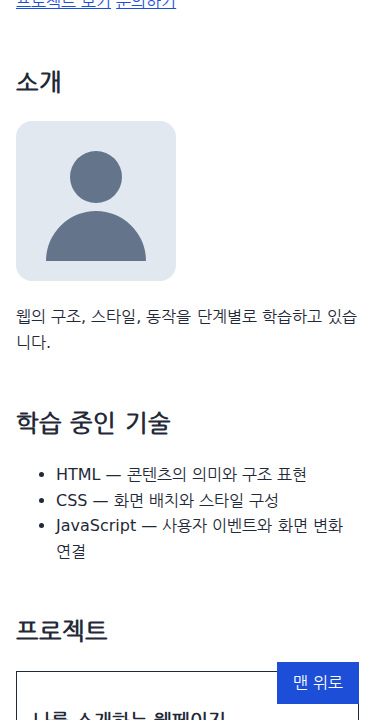

# 스크롤 이벤트로 맨 위로 버튼 표시하기

## 1. 학습 목적

[과제 PDF](../assignment-requirements.pdf) 4쪽은 스크롤 위치가 300px 이상이면 버튼을 표시하고, 클릭하면 페이지 맨 위로 이동하도록 요구한다. 아래쪽 내용을 읽다가 상단으로 돌아갈 때 사용할 수 있는 기능이다.

이번 핵심 개념은 스크롤 이벤트다. 페이지의 스크롤 위치가 바뀌면 현재 위치를 읽고, 조건에 따라 버튼의 숨김 상태를 갱신한다. 기준값은 과제에 제시된 300px을 사용하고 [README](../../README.md#스크롤-기준값)에도 명시했다.

## 2. 핵심 개념

`window`는 현재 페이지의 브라우저 창을 나타내는 객체다. `window.scrollY`는 문서 위쪽에서 현재 화면이 얼마나 내려와 있는지 나타내는 숫자이며, 단위는 CSS의 px이다. 이 페이지의 맨 위에서는 0이다.

`scroll` 이벤트는 스크롤 위치가 바뀔 때 발생한다. 휠·터치·키보드 조작뿐 아니라 코드로 위치를 이동할 때도 발생하므로, 페이지의 위치에 맞춰 화면을 갱신하는 데 사용한다.

| 코드 | 역할과 입출력 |
| --- | --- |
| `document.querySelector('#scroll-top')` | ID 선택자에 맞는 첫 요소를 반환한다. 없으면 `null`이다. 이번에는 HTML의 버튼을 선택한다. |
| `window.addEventListener('scroll', updateScrollTopButton)` | 이벤트 이름과 실행할 함수를 받아 연결한다. 반환값은 `undefined`이며, 연결 이후 이벤트가 발생하면 브라우저가 함수를 호출한다. |
| `window.scrollY < 300` | 현재 위치와 기준값을 비교해 참인 `true` 또는 거짓인 `false`를 만든다. |
| `scrollTopButton.hidden = …` | 버튼의 숨김 상태를 바꾼다. 이 코드에서 `true`를 넣으면 숨기고, `false`를 넣으면 숨김을 해제한다. |
| `window.scrollTo({ top: 0, behavior: 'smooth' })` | 옵션을 담은 객체를 받아 이동을 요청한다. `top`은 목적지의 세로 좌표, `behavior`는 이동 방식이다. |

검증한 Chromium 153에서 `scrollTo()`는 비동기 작업의 완료를 나타내는 `Promise` 객체를 반환했다. 이번 코드는 그 반환값을 사용하지 않고, 이동 중 발생하는 `scroll` 이벤트와 현재 위치로 버튼을 갱신한다. 반환값에 의존하지 않으므로 이 단계에서 별도의 비동기 처리는 구현하지 않았다.

## 3. 프로젝트 적용

[src/index.html](../../src/index.html)의 본문 끝에 버튼을 추가했다.

```html
<button id="scroll-top" type="button" hidden>맨 위로</button>
```

처음에는 `hidden`으로 숨겨 두고 JavaScript에서 현재 위치에 맞게 표시 여부를 정한다. `type="button"`은 일반 동작 버튼임을 명시한다.

[src/js/main.js](../../src/js/main.js)의 핵심 코드는 다음과 같다.

```js
const scrollTopButton = document.querySelector('#scroll-top');

const updateScrollTopButton = () => {
  scrollTopButton.hidden = window.scrollY < 300;
};

window.addEventListener('scroll', updateScrollTopButton);

scrollTopButton.addEventListener('click', () => {
  window.scrollTo({ top: 0, behavior: 'smooth' });
});

updateScrollTopButton();
```

`updateScrollTopButton`은 현재 위치를 읽어 버튼을 갱신하는 함수다. 인자를 사용하지 않고, 명시적인 반환값 없이 버튼의 상태를 바꾼다. 이벤트에 함수를 전달할 때는 `updateScrollTopButton`처럼 이름을 쓰고, 마지막 줄에서 즉시 실행할 때는 `updateScrollTopButton()`처럼 괄호를 붙인다. 마지막 호출은 첫 실행 시점의 위치도 반영하기 위한 것이다.

버튼을 누르면 기존에 배운 클릭 이벤트로 `scrollTo()`를 호출한다. `top: 0`이 문서 맨 위를 지정하고, `behavior: 'smooth'`가 이동 방식을 지정한다. 이동하는 동안에도 스크롤 이벤트가 발생하므로 300px 미만으로 올라오면 같은 함수가 버튼을 숨긴다.

[src/css/style.css](../../src/css/style.css)의 `#scroll-top`에는 다음 배치를 적용했다. 색상·글꼴·여백 선언은 발췌에서 생략했다.

```css
#scroll-top {
  position: fixed;
  right: var(--space-page);
  bottom: var(--space-page);
}
```

이 페이지에서 `position: fixed`는 버튼을 브라우저의 표시 영역인 뷰포트 기준으로 배치한다. 스크롤해도 오른쪽·아래쪽에서 같은 간격으로 보이게 하려는 것이다. 숨김 처리는 `hidden`으로 제어하므로 이 버튼에는 숨김을 덮어쓰는 `display` 선언을 추가하지 않았다.

## 4. 실행 흐름

예를 들어 299px에서 300px로 내려오면 다음 순서로 실행된다.

1. 위치가 바뀌어 `scroll` 이벤트가 발생한다.
2. 연결된 `updateScrollTopButton` 함수가 실행된다.
3. `window.scrollY`에서 300을 읽는다.
4. `300 < 300`의 결과인 `false`를 버튼의 `hidden`에 넣는다.
5. 숨김이 해제되어 버튼이 나타난다.

| 현재 위치 | `< 300`의 결과 | `hidden` | 화면 |
| --- | --- | --- | --- |
| 0px | `true` | `true` | 숨김 |
| 299px | `true` | `true` | 숨김 |
| 300px | `false` | `false` | 표시 |
| 600px | `false` | `false` | 표시 |

즉, 이 조건은 ‘보여 줄 것인가’가 아니라 ‘숨길 것인가’를 계산한다. 버튼 클릭 후에는 `scrollTo()`가 위로 이동시키고, 다시 300px 미만이 되면 `hidden`이 `true`로 바뀐다.

## 5. 확인 방법과 결과

### 검증 목적

299px·300px·301px를 확인하면 과제의 ‘300px 이상’을 정확히 구현했는지 알 수 있다. 아래로 내려갈 때뿐 아니라 다시 올라갈 때도 검사해 버튼이 계속 남아 있지 않은지 확인한다. 클릭 검사는 실제 목적지가 0px인지, 첫 진입·새로고침 검사는 현재 위치와 버튼 표시가 일치하는지 확인하기 위한 것이다.

### 직접 확인하는 방법

1. [README의 실행 방법](../../README.md#실행과-확인)에 따라 페이지를 연다. 맨 위에서는 버튼이 보이지 않는다.
2. 아래로 스크롤한다. 300px 이상에서 오른쪽 아래에 ‘맨 위로’ 버튼이 나타난다.
3. 버튼을 누른다. 화면이 맨 위로 이동하며, 올라가는 중 300px 미만이 되면 버튼이 숨겨진다.

정확한 경계값을 확인할 때는 개발자 도구의 **Console**에서 다음 명령을 하나씩 실행할 수 있다. Console은 JavaScript를 입력하고 실행 결과를 확인하는 곳이다.

```js
window.scrollTo({ top: 299, behavior: 'instant' });
window.scrollTo({ top: 300, behavior: 'instant' });
window.scrollTo({ top: 301, behavior: 'instant' });
```

각 줄을 실행한 뒤 버튼을 관찰한다. 여기서만 `instant`를 쓰는 이유는 중간 이동 없이 정확한 위치의 표시 상태를 확인하기 위해서다. 소스 파일의 클릭 동작은 `smooth`다.

### 확인한 결과

2026-09-09 로컬 HTTP 서버, Chromium 153.0.8010.12, Playwright 1.63.0, 한글 나눔 글꼴 환경에서 1280×720과 375×720 화면을 검증했다.

- 두 화면 모두 0px·299px에서 숨김, 300px·301px·600px에서 표시, 다시 299px로 올라가면 숨김이었다.
- 600px에서 버튼을 클릭하면 중간 위치를 거쳐 0px에 도착했고 버튼이 숨겨졌다.
- `#projects`로 직접 접속하거나 해당 위치에서 새로고침해도 버튼이 표시됐다.
- 표시된 버튼은 두 화면 모두 뷰포트 안에 있었으며 JavaScript 오류는 없었다.



375×720 화면에서 300px 내려간 상태다. 오른쪽 아래의 버튼이 표시되는 모습을 확인할 수 있다. 이 캡처는 버튼의 표시 상태를 보여 준다.

## 6. 추가 확인

`hidden`은 HTML 요소를 삭제하는 동작이 아니다. 버튼은 문서에 남아 있으며, `hidden = false`로 숨김을 해제할 수 있다.

현재 버튼은 JavaScript로 위치 확인과 클릭 처리를 수행한다. 이 기능을 사용하려면 JavaScript가 활성화되어 있어야 한다.

## 7. 참고자료

- [과제 PDF 4쪽](../assignment-requirements.pdf): 300px 이상에서 버튼 표시, 클릭 시 맨 위 이동과 README 기준값 명시 요구사항.
- [CSSOM View — scrollY](https://drafts.csswg.org/cssom-view/#dom-window-scrolly), [scrollTo](https://drafts.csswg.org/cssom-view/#dom-window-scrollto), [Scrolling events](https://drafts.csswg.org/cssom-view/#scrolling-events): 현재 위치 읽기, 이동 옵션과 스크롤 이벤트. 2026-07-12 Editor’s Draft와 검증 브라우저를 기준으로 설명했다.
- [WHATWG HTML — hidden](https://html.spec.whatwg.org/multipage/interaction.html#the-hidden-attribute): 요소의 숨김 상태와 CSS가 표시 여부에 영향을 줄 수 있다는 점. 버튼 표시 처리에 적용했다.
- [CSS Positioned Layout Level 3 — Fixed positioning](https://www.w3.org/TR/css-position-3/#fixed-positioning): 화면을 기준으로 버튼을 고정하는 배치에 적용했다.
- [클릭 이벤트 학습 기록](009-menu-click-event.md): 요소 선택과 addEventListener로 함수를 연결하는 기존 학습 내용을 재사용했다.

참고자료 확인일: 2026-09-10.
