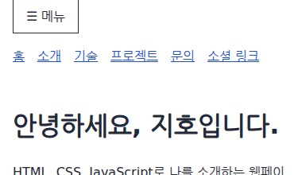
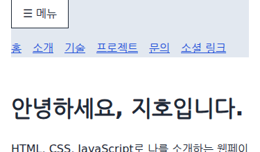

# 조건에 따라 클래스를 적용해 내비게이션 배경 바꾸기

## 1. 학습 목적

[과제 PDF](../assignment-requirements.pdf) 5쪽의 ‘스크롤 60px 이상에서 내비게이션 배경색 변경’을 구현한다. 페이지가 상단에서 내려온 상태를 내비게이션의 색으로 표현하는 기능이다. 기준값은 60px을 사용하고 [README](../../README.md#스크롤-기준값)에 명시했다.

이번 개념은 `classList.toggle()`에 조건을 전달하는 방법이다. [스크롤 이벤트](011-scroll-event.md)로 위치를 읽고, JavaScript는 클래스의 적용 여부를, CSS는 해당 상태의 배경색을 담당한다.

## 2. 핵심 개념

`classList`는 요소에 붙은 클래스 이름들을 다루는 객체다. `toggle()`의 첫 번째 인자는 클래스 이름이고, 두 번째 인자 `force`는 그 클래스를 적용할지 정하는 참·거짓 값이다. 호출 결과로 해당 클래스가 있으면 `true`, 없으면 `false`를 반환한다. 이번 코드에서는 반환값을 사용하지 않는다.

| 호출 | 동작 |
| --- | --- |
| `classList.toggle('active')` | 있으면 제거하고, 없으면 추가한다. 기존 메뉴 버튼에서 클릭할 때마다 상태를 뒤집는 방식이다. |
| `classList.toggle('scrolled', true)` | 클래스를 추가한다. 이미 있으면 유지한다. |
| `classList.toggle('scrolled', false)` | 클래스를 제거한다. 이미 없으면 없는 상태를 유지한다. |

스크롤에서는 같은 조건을 만족하는 이벤트가 연속으로 발생한다. 예를 들어 60px에서 61px로 내려가도 변경된 배경색을 유지해야 한다. 두 번째 인자를 생략하면 호출마다 클래스가 붙었다 떨어지므로, 현재 위치를 비교한 결과를 전달한다.

`scrolled`는 직접 정한 클래스 이름이다. 이름 자체에 배경색을 바꾸는 기능은 없으며, CSS에 작성한 `nav.scrolled` 규칙과 연결되어 화면을 바꾼다.

## 3. 프로젝트 적용

[src/js/main.js](../../src/js/main.js)의 기존 `navigation` 변수는 `nav` 요소를 가리킨다. 새로 추가한 함수는 다음과 같다.

```js
const updateNavigationBackground = () => {
  navigation.classList.toggle('scrolled', window.scrollY >= 60);
};

window.addEventListener('scroll', updateNavigationBackground);
updateNavigationBackground();
```

`window.scrollY >= 60`이 참이면 클래스를 적용하고 거짓이면 제거한다. `updateNavigationBackground`는 인자와 명시적인 반환값 없이 현재 위치를 읽어 클래스를 갱신한다. 스크롤 이벤트에 함수를 연결하고, 마지막 줄에서 처음 한 번 실행해 현재 위치를 반영한다.

[src/css/style.css](../../src/css/style.css)에서는 기본 배경과 클래스가 있는 상태를 구분한다.

```css
nav {
  background-color: var(--color-background);
}

nav.scrolled {
  background-color: var(--color-navigation-scrolled);
}
```

발췌에서 기존 내비게이션 배치 선언은 생략했다. 새 변수 `--color-navigation-scrolled`는 기본 `:root`와 기존 `[data-theme="dark"]`에 각각 정의했다. 기존 테마에 맞는 색을 사용하기 위한 것이다.

| 테마 | 기본 배경 | 60px 이상 배경 |
| --- | --- | --- |
| 기본 | `#ffffff` | `#e2e8f0` |
| dark | `#111827` | `#1f2937` |

코드 구현은 Claude Code에 위임했고, 변경 범위 검토·브라우저 검증·학습 문서 작성은 Codex가 수행했다. 구현 변경은 JavaScript와 CSS 두 파일이다.

## 4. 실행 흐름

1. 59px에서 60px로 내려가며 `scroll` 이벤트가 발생한다.
2. `updateNavigationBackground`가 실행되어 `60 >= 60`을 계산한다.
3. 결과가 `true`이므로 `nav`에 `scrolled` 클래스가 붙는다.
4. `nav.scrolled`의 배경색이 적용된다.
5. 61px·62px로 더 내려가도 조건이 참이므로 같은 색을 유지한다.
6. 다시 59px로 올라오면 조건이 거짓이 되어 클래스가 제거되고 기본 배경으로 돌아간다.

기존 `menu-ready` 클래스는 그대로 남는다. 특정 클래스 하나를 다루므로 메뉴의 준비 상태와 스크롤 상태를 같은 요소에서 함께 표현할 수 있다.

## 5. 확인 방법과 결과

### 검증 목적과 직접 확인

59px·60px는 ‘60px 이상’의 경계를, 61px·62px는 연속 이벤트에서도 색이 유지되는지를 확인한다. 다시 59px로 올라가는 검사는 클래스 제거와 기본색 복원을 확인하기 위한 것이다.

현재 내비게이션은 상단에 고정되지 않고 페이지와 함께 스크롤된다. 따라서 화면 밖으로 나간 뒤에는 색상 변화가 눈에 보이지 않을 수 있다. 모바일 너비에서 메뉴를 펼치면 59px·60px에서도 링크 영역이 보여 두 상태를 직접 비교할 수 있다.

1. [README의 실행 방법](../../README.md#실행과-확인)에 따라 페이지를 연다.
2. 화면 너비를 375px 정도로 줄이고 메뉴 버튼을 눌러 링크를 펼친다.
3. 개발자 도구의 Console에서 아래 명령을 한 줄씩 실행한다. 각 실행 후 내비게이션 배경을 확인한다.

```js
window.scrollTo({ top: 59, behavior: 'instant' });
window.scrollTo({ top: 60, behavior: 'instant' });
window.scrollTo({ top: 61, behavior: 'instant' });
window.scrollTo({ top: 59, behavior: 'instant' });
```

`instant`는 검사할 위치로 바로 이동하기 위해 사용한다. 기능의 판단 기준은 이동 방식과 관계없이 현재 스크롤 위치다. Elements에서 `nav`의 클래스에 `scrolled`가 붙고 제거되는지도 확인할 수 있다.



59px: 링크 뒤쪽에 기본 흰색 배경이 적용된다. 375×720 실행 화면의 상단 부분을 캡처했다.



60px: 같은 링크 영역의 배경이 `#e2e8f0`으로 바뀐다. 본문의 배경은 흰색이다.

### 확인한 결과

2026-09-13 로컬 HTTP 서버, Chromium 153.0.8010.12, Playwright 1.63.0, 나눔 글꼴 환경에서 1280×720·375×720과 기본·dark 테마의 네 조합을 확인했다. dark는 기존 `data-theme` 속성을 지정해 검증했다.

- 0px·59px에서는 `scrolled`가 없고 기본 배경이 적용됐다.
- 60px·61px·62px·120px에서는 `scrolled`와 테마별 변경 배경이 유지됐다.
- 다시 59px·0px로 올라오면 클래스가 제거되고 기본색으로 복원됐다.
- `#projects`로 직접 접속하거나 새로고침해도 현재 위치에 맞는 클래스가 적용됐다.
- 기존 모바일 메뉴의 열기·닫기와 맨 위로 버튼의 복귀 동작을 확인했다. JavaScript 오류는 없었다.

## 6. 추가 확인

배경색 변경과 상단 고정은 서로 다른 동작이다. 이번 단계에서는 과제에서 요구한 배경색 변경을 구현했으며, 내비게이션의 기존 배치는 변경하지 않았다.

## 7. 참고자료

- [과제 PDF 5쪽](../assignment-requirements.pdf): 스크롤 60px 이상에서 내비게이션 배경색을 바꾸고 기준값을 README에 명시하는 요구사항.
- [WHATWG DOM — DOMTokenList.toggle](https://dom.spec.whatwg.org/#dom-domtokenlist-toggle): 두 번째 인자 `force`의 의미와 반환값. 연속 스크롤에서 조건에 따라 클래스를 유지·제거하는 구현에 적용했다.
- [스크롤 이벤트 학습 기록](011-scroll-event.md): `scroll` 이벤트와 `scrollY`를 사용해 현재 위치를 읽는 기존 개념.
- [CSS 변수 학습 기록](004-css-custom-properties.md), [테마 속성 선택자 학습 기록](005-theme-attribute-selector.md): 기존 테마 변수 구조에 내비게이션 배경색을 추가하는 데 활용했다.

참고자료 확인일: 2026-09-13.
