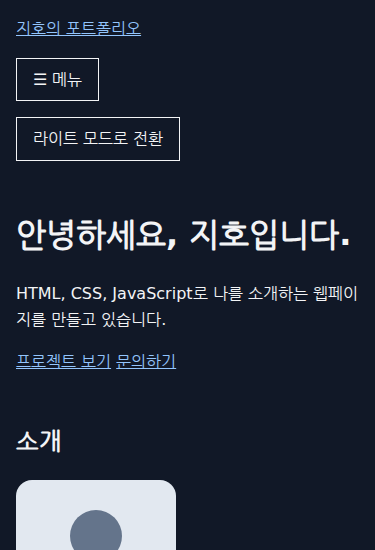

# localStorage로 테마 선택 저장하고 복원하기

## 1. 학습 목적

다크 모드 선택을 새로고침 후에도 유지한다. 기존 CSS의 테마 색상을 재사용하고, 브라우저 저장소에 선택을 남기는 흐름을 익힌다.

## 2. 핵심 개념

`localStorage`는 같은 출처(프로토콜·호스트·포트)의 페이지가 공유하는 문자열 저장소다. 페이지를 새로고침해도 값이 남는다. 서버로 전송하는 기능은 아니다.

- `getItem('theme')`: 키에 저장된 문자열을 반환한다. 키가 없으면 `null`이다.
- `setItem('theme', 'dark')`: 키와 값을 저장하거나 기존 값을 덮어쓴다. 반환값은 `undefined`다.
- `getItem('theme') || 'light'`: 읽은 값이 없거나 빈 문자열이면 기본값 `light`를 선택한다.

`dataset.theme`는 HTML의 `data-theme` 속성을 읽고 쓴다. `textContent`는 버튼의 글자를 바꾼다. 저장 자체가 화면을 바꾸는 것은 아니므로, 읽은 값을 화면에 적용하는 코드가 필요하다.

## 3. 프로젝트 적용

[main.js](../../src/js/main.js)의 `applyTheme(theme)`는 인자로 받은 테마를 `<html>`과 버튼 문구에 적용한다. 초기 복원과 클릭에서 같은 함수를 호출해 화면 갱신을 한곳에 모았다. 별도의 반환값은 없다.

```js
const savedTheme = localStorage.getItem('theme') || 'light';
applyTheme(savedTheme);
```

클릭 시 현재 속성을 읽고 다음 테마를 정한다. `조건 ? 값1 : 값2`는 조건이 참이면 값1, 거짓이면 값2를 선택하는 삼항 연산자다.

```js
const nextTheme = currentTheme === 'dark' ? 'light' : 'dark';
applyTheme(nextTheme);
localStorage.setItem('theme', nextTheme);
```

[index.html](../../src/index.html)의 `#theme-toggle`은 모바일 메뉴가 접혀 있어도 보인다. [style.css](../../src/css/style.css)의 기존 테마 변수로 배경·글자·링크와 버튼 색상을 적용한다.

## 4. 실행 흐름

저장값 없음 → `light` 적용 → ‘다크 모드로 전환’ 클릭 → `dark` 속성과 ‘라이트 모드로 전환’ 문구 적용 → `theme=dark` 저장 → 새로고침 → 저장된 `dark`를 읽어 같은 화면 복원.

버튼 문구는 현재 상태가 아니라 **누르면 실행할 동작**을 나타낸다.

## 5. 확인 방법과 결과

[README의 HTTP 서버 실행 방법](../../README.md#실행과-확인)으로 페이지를 연다. 개발자 도구 Console에서 `localStorage.removeItem('theme')`를 실행하고 새로고침하면 저장값 없는 상태부터 확인할 수 있다.

1. 기본 라이트 화면에서 테마 버튼을 누른다.
2. 어두운 배경과 ‘라이트 모드로 전환’ 문구를 확인한다. `localStorage.getItem('theme')`는 `'dark'`를 반환해야 한다.
3. 새로고침해 같은 화면이 유지되는지 확인한다.
4. 다시 버튼을 누르고 새로고침한다. 밝은 배경과 `'light'` 저장값이 유지되어야 한다.

2026-09-13, 로컬 HTTP 서버와 Playwright 1.63.0·Chromium 153.0.8010.12에서 1280×720·375×720으로 위 흐름을 검증했다. 기본값, 양방향 전환·새로고침 복원, 버튼 문구·저장값·배경색 일치, 가로 넘침 없음과 모바일 메뉴 동작을 확인했다. JavaScript 문법 검사도 통과했고 브라우저 오류는 없었다.



375px 화면의 상단 캡처다. 새로고침 후 어두운 배경과 다음 동작을 나타내는 버튼 문구가 유지된다.

저장소 사용이 허용된 HTTP 환경을 기준으로 한다. 현재 저장소 차단·저장 실패 예외 처리는 없으며, 입력 컨트롤과 임시 SVG의 테마 색상은 적용하지 않았다.

## 6. 참고자료

- [WHATWG HTML — Web storage](https://html.spec.whatwg.org/multipage/webstorage.html#the-localstorage-attribute): 출처별 저장과 지속성, `getItem`·`setItem`의 인자·반환값을 확인하고 테마 저장·복원에 적용했다. Living Standard, 확인일 2026-09-13.
- [기존 테마 속성 선택자 학습 기록](005-theme-attribute-selector.md): `data-theme`와 CSS 색상 변수의 연결 구조.
